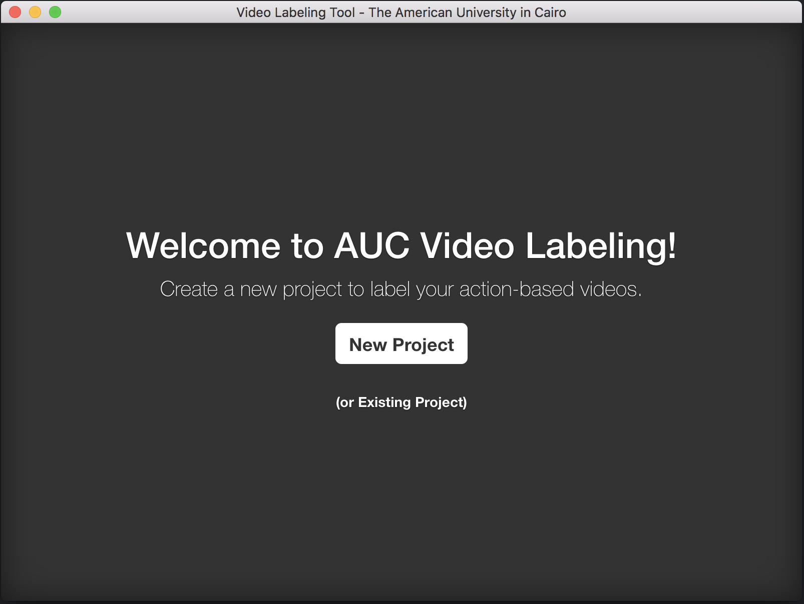
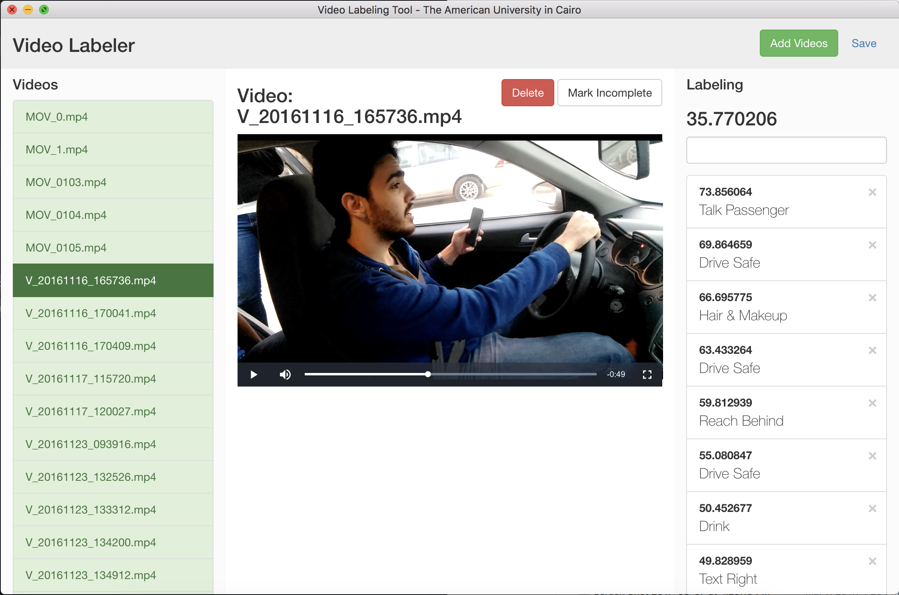

# Action Annotation Tool

## Introduction

In this tool, you could add your videos, and then, label them. The output of this tool is an `*.aucvl` file (which is nothing more than a json file containing the application state).

## Stack

This application is built on top of Electron and AngularJS.

## Installation

### 0. Prerequisites

You should have `Node` and `NPM` installed on your machine. Thus, it is usable on Windows, Linux, and Mac.

### 1. Clone the repository
```
git clone https://github.com/devyhia/action-annotation
```

### 2. Install the dependencies
```
npm install
```

### 3. Run the application
```
npm start
```

## Why use it?

### Keyboard Shortcuts
When labeling a video, you want to be as efficient as possible. Using shortcuts was extremely efficient in that process. Here is a list of all of the shortcuts:

Shortcut    | Description
--- | ---
`ctrl+k`      | Focus on the labeling text box. This also pauses the video at the current moment/second/millisecond.
`ctrl+n`      | Adds a new video. Prompts an open dialog where you could select a new video file.
`ctrl+l`      | Focuses on the "create new label" text box. Whenever a new label is added, it becomes available immediately in the classification text box (accessible through `ctrl+k`).
`ctrl+left`    | Moves one second to the left (of a playing video).
`ctrl+right`  | Moves one second to the right (of a playing video).
`ctrl+p`      | Pauses the currently playing video.

## Preview

### Home Page



### Labeling Page


